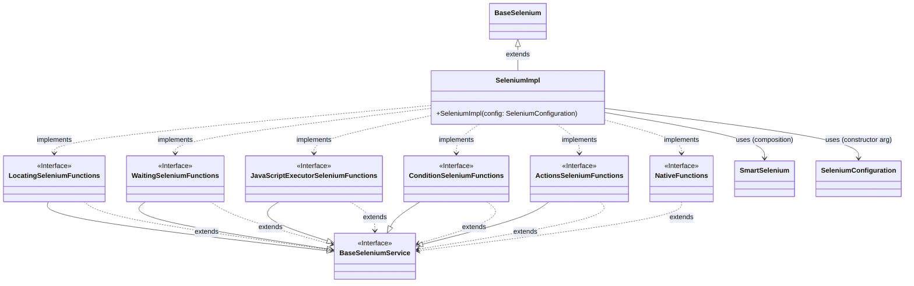
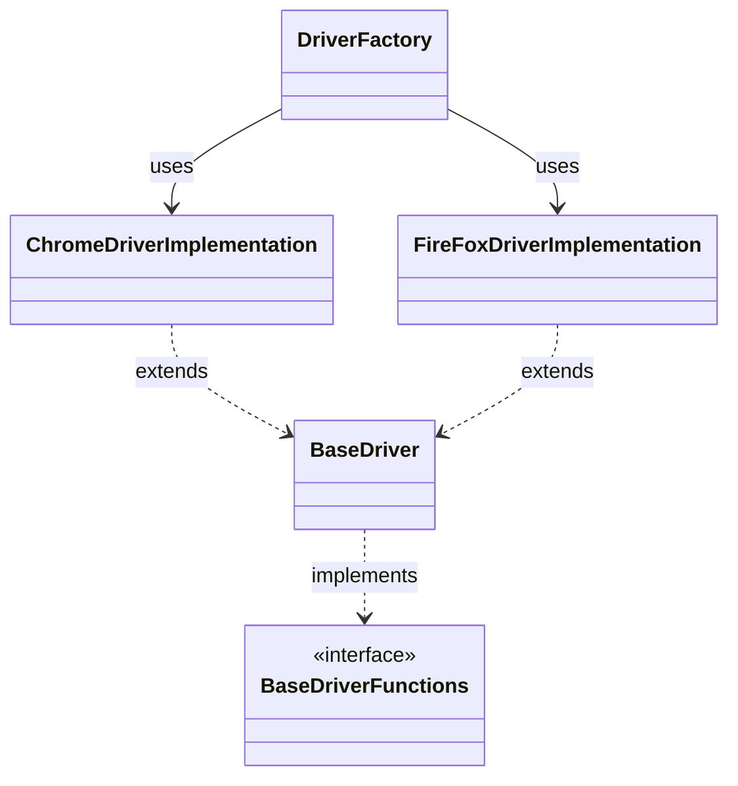
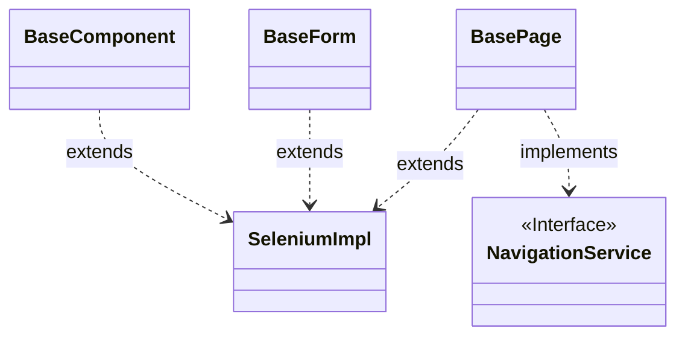
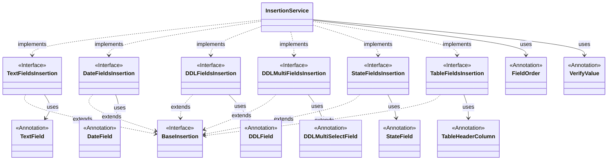

# UI Commons Module

## Overview

The **UI Commons** module is a library built on top of Selenium to simplify and enhance the usage of Selenium WebDriver for UI automation. It provides reusable templates, utilities, and components that speed up the creation and management of Selenium-based frameworks. The module supports advanced interactions, field management, and table handling, making it easier to build maintainable and scalable test automation projects.

## Features

### Modular Structure
The module is divided into distinct packages for easy navigation and usage:
- **`annotations`**: Custom annotations to define and manage UI fields and table headers.
- **`base`**: Foundational components for pages, forms, and reusable UI elements.
- **`drivers`**: Driver management with support for Chrome and Firefox.
- **`features`**: Predefined implementations for dropdowns, input fields, state fields, and tables.
- **`functions`**: Selenium wrappers for actions, conditions, locating, and JavaScript execution.
- **`service`**: Lightweight service classes and insertion utilities.
- **`util`**: General utilities for screenshots, assertions, and native OS interactions.

### Selenium Enhancements
- Custom wrappers around Selenium functions for robust element interaction.
- Utility classes for common Selenium operations like locating elements, waiting, and taking screenshots.
- Enhanced handling of stale elements and dynamic waits.

### Field Management
- Predefined implementations for dropdowns, input fields, and state fields.
- Simplified interaction with complex UI components.

### Table Handling
- Modular and extensible table reading and interaction capabilities.
- Abstracted logic for parsing table rows and columns.

### Driver Management
- Configurable and reusable driver setup.
- Supports Chrome and Firefox drivers with WebDriverManager integration.

### Test Scenarios
- A base test scenario class that includes Selenium and data storage capabilities.
- Response tracking for network requests (Selenium 4 feature).

---

## Structure

### Annotations
Custom annotations to mark fields and columns in the UI:
- **`DateField`**
- **`DDLField`**
- **`DDLMultiSelectField`**
- **`FieldOrder`**
- **`StateField`**
- **`TableHeaderColumn`**
- **`TextField`**
- **`VerifyValue`**

### Base Components
Core components to build reusable UI structures:
- **`BaseComponent`**
- **`BasePage`**
- **`BaseForm`**
- **`NavigationService`**

### Data Management
Enums and assertion-related utilities:
- **`AssertionResult`**
- **`AssertionType`**
- **`DateFieldType`**
- **`DDLType`**
- **`StateFieldType`**
- **`TextFieldType`**
- **`TransformValueToVerify`**

### Driver Management
Reusable driver configurations and implementations:
- **`BaseDriver`**
- **`BaseDriverFunctions`**
- **`DriverFactory`**
- **`ChromeDriverImplementation`**
- **`FireFoxDriverImplementation`**
- **`DriverException`**

### Features
Field and table interaction utilities:
- **Dropdown Fields**: `BaseDropDownFieldImpl`, `DropDownFieldService`, `DropDownFieldComponent`
- **Input Fields**: `BaseInputFieldImpl`, `InputFieldService`, `InputFieldComponent`
- **State Fields**: `BaseStateFieldImpl`, `StateFieldService`, `StateFieldComponent`
- **Tables**: `BaseTableReaderImpl`, `TableReaderService`, `BaseTableComponent`, `TableCellFunctions`

### Functions
Selenium function wrappers for enhanced capabilities:
- **Actions**: `ActionsSeleniumFunctions`
- **Conditions**: `ConditionSeleniumFunctions`
- **JavaScript**: `JavaScriptExecutorSeleniumFunctions`
- **Locating**: `LocatingSeleniumFunctions`
- **Native Actions**: `NativeFunctions`
- **Waiting**: `WaitingSeleniumFunctions`
- **Configuration**: `SeleniumConfiguration`
- **Base Selenium Wrapper**: `SeleniumImpl`

### Utilities
General-purpose utilities for Selenium and test automation:
- **`RobotUtility`**: For native OS interactions using Java AWT Robot.
- **`ScreenshotUtil`**: For capturing and saving screenshots.
- **`SmartSelenium`**: Advanced interaction with Selenium elements.
- **`AnnotationUtil`**: Utility for processing custom annotations.
- **`AssertionUtil`**: For merging and handling assertion results.

### Test Services
Lightweight services and base test scenario classes:
- **`BaseTestScenario`**: A base class for defining custom test scenarios with Selenium and data storage.
- **`UIType`**: Interface for declaring UI elements as enums for better organization.

---


## Dependencies
This module relies on the following libraries:
- **commons**: For logging.
- **selenium-java**: For UI manipulation.
- **webdrivermanager**: For downloading drivers.
- **javatuples**: For using tuples in the java code.

---


## Architecture

### Core Selenium



### Drivers


### Base Components


### Components

```mermaid
classDiagram
    class TableReaderService {
        <<Interface>>
    }
    class TableCellFunctions {
        <<Interface>>
    }
    class BaseTableReaderImpl {
    }
    class BaseTableComponent {
    }
    class SeleniumImpl {
    }
    class DropDownFieldService {
        <<Interface>>
    }
    class BaseDropDownFieldImpl {
    }
    class DropDownFieldComponent {
    }
    class InputFieldService {
        <<Interface>>
    }
    class BaseInputFieldImpl {
    }
    class InputFieldComponent {
    }
    class StateFieldService {
        <<Interface>>
    }
    class BaseStateFieldImpl {
    }
    class StateFieldComponent {
    }


    BaseTableReaderImpl ..> TableReaderService: implements
    BaseTableReaderImpl ..> TableCellFunctions: implements
    BaseTableReaderImpl --> SeleniumImpl: uses (composition)
    BaseTableComponent --> TableReaderService: uses (constructor arg)

    BaseDropDownFieldImpl ..> DropDownFieldService: implements
    BaseDropDownFieldImpl --> SeleniumImpl: uses (composition)
    DropDownFieldComponent --> DropDownFieldService: uses (constructor arg)

    BaseInputFieldImpl ..> InputFieldService: implements
    BaseInputFieldImpl ..> TableCellFunctions: implements
    BaseInputFieldImpl --> SeleniumImpl: uses (composition)
    InputFieldComponent --> InputFieldService: uses (constructor arg)

    BaseStateFieldImpl ..> StateFieldService: implements
    BaseStateFieldImpl --> SeleniumImpl: uses (composition)
    StateFieldComponent --> StateFieldService: uses (constructor arg)

```


### Insertion Service


## Installation

Add the following dependency to your Maven `pom.xml`:

```xml
<dependency>
    <groupId>com.maksystem</groupId>
    <artifactId>ui-commons</artifactId>
    <version>${project.version}</version>
</dependency>
```

## Usage

The **UI Commons** module provides a powerful way to manage data insertion and verification for complex UI forms. Below are examples demonstrating how to use the `InsertionService`, custom annotations, and data models to streamline your UI automation tasks.

### Example 1: Using `InsertionService` with Data Models and Annotations

#### Step 1: Define Your Data Model

Create a data model class representing the fields in your UI form. Use custom annotations like `@TextField`, `@DateField`, `@DDLField`, etc., to specify field locators, names, types, and any transformations needed for verification.

```java
@Data
@Builder
public class DataModel {

    @TextField(
            value = @FindBy(xpath = "//div[@class='field-caption']/label[contains(text(), 'Text Field Label')]"),
            name = "Text Field",
            type = TextFieldType.CLICK_CLEAR_AND_INSERT,
            transformToVerify = TransformValueToVerify.TO_UPPER_CASE)
    @FieldOrder(1)
    @VerifyValue
    private String textField;

    @StateField(
            value = @FindBy(xpath = "//div[@class='field-caption']/label[contains(text(), 'State Field Label')]"),
            name = "State Field",
            type = StateFieldType.SELECT_AND_ENTER)
    @FieldOrder(2)
    private String stateField;

    @DateField(
            value = @FindBy(xpath = "//div[@class='field-caption']/label[contains(text(), 'Date Field Label')]"),
            name = "Date Field")
    @FieldOrder(3)
    private String dateField;

    @DDLField(
            value = @FindBy(xpath = "//div[@class='field-caption']/label[contains(text(), 'Ddl Field Label')]"),
            name = "DDL Field")
    @FieldOrder(4)
    private String ddlField;

    // Additional fields can be added here...
}
```

#### Step 2: Implement a Custom InsertionService

Extend the InsertionService class and override its methods to define how data should be inserted into the fields, according to your application's UI specifics.

```java
public class CustomInsertionService extends InsertionService {

    private SeleniumImpl selenium;

    public CustomInsertionService(SeleniumImpl selenium) {
        this.selenium = selenium;
    }

    @Override
    public void insertTextValue(By by, String value, TextFieldType textFieldType) {
        if (textFieldType.equals(TextFieldType.CLICK_CLEAR_AND_INSERT)) {
            WebElement input = selenium.locatingWaitAndFindElementFromRoot(by);
            input.click();
            selenium.actionClearAndSendKeys(input, value);
        }
        // Implement other text field types as needed
    }

    @Override
    public void insertDDLValue(By by, String value) {
        WebElement labelField = selenium.locatingWaitAndFindElementFromRoot(by);
        WebElement inputContainer = selenium.locatingWaitAndFindElement(
            labelField,
            new ByChained(By.xpath(".."), By.xpath(".."))
        );
        new Select(inputContainer).selectByVisibleText(value);
    }

    // Override other methods for DateField, StateField, etc.
}
```

#### Step 3: Use the InsertionService in Your Tests

Instantiate your CustomInsertionService and use it to insert data into your forms efficiently.

```java
public class ExampleTest {

    public void test() {
        WebDriver driver = new ChromeDriver();
        SeleniumConfiguration seleniumConfig = SeleniumConf.createStandardSeleniumConfiguration(driver);
        InsertionService insertionService = new CustomInsertionService(new SeleniumImpl(seleniumConfig));

        // Build your data model with the desired values
        DataModel data = DataModel.builder()
                .textField("Value for Text field")
                .dateField("2024-11-24")
                .ddlField("Value for DDL field")
                .build();

        // Insert all fields from the data object
        // Fields with null values will be skipped
        // Fields are inserted in the order specified by @FieldOrder
        insertionService.insertFieldsFromData(data);

        // Verify all fields annotated with @VerifyValue
        // The textField will be transformed to upper case for verification
        insertionService.verifyFieldsFromData(data);

        // Insert only the textField value using the locator and type from the DataModel class
        insertionService.insertTextFieldValue(DataModel.class, "textField", "New Value for text field");

        // Alternatively, insert text value directly using a locator and type
        insertionService.insertTextFieldValue(
                "//div[@class='field-caption']/label[contains(text(), 'Text Field Label')]",
                "Direct Value",
                TextFieldType.CLICK_CLEAR_AND_INSERT
        );

        // Similar functions are available for other field types: DDL, Date, State, etc.
    }
}
```

### Example 2: Using Specific Field Insertion Interfaces

If you need to work with a specific type of field, you can use the dedicated interfaces provided by the module, such as `DDLFieldsInsertion`.

```java
public class Example {

    public void test() {
        // Create an instance of DDLFieldsInsertion
        DDLFieldsInsertion ddlFieldsInsertion = new DDLInsertionOnly();

        // Insert value into a DDL field using a locator
        ddlFieldsInsertion.insertDDLValue(By.cssSelector("ddl-locator"), "Option 1");

        // Insert value with a specific DDLType
        ddlFieldsInsertion.insertDDLValue(
            By.cssSelector("ddl-locator"),
            "Option 2",
            DDLType.FIND_SELECT_ELEMENT
        );

        // Read the current value of a DDL field
        String selectedValue = ddlFieldsInsertion.readDDLFieldValue(By.cssSelector("ddl-locator"));
    }

    // Implementation of DDLFieldsInsertion
    public class DDLInsertionOnly implements DDLFieldsInsertion {

        @Override
        public void insertDDLValue(By by, String value) {
            // Implement DDL insertion logic without specifying DDLType
        }

        @Override
        public void insertDDLValue(By by, String value, DDLType ddlType) {
            // Implement DDL insertion logic based on DDLType
        }

        @Override
        public String readDDLFieldValue(By by) {
            // Implement logic to read the selected value from a DDL field
            return "Current Selected Value";
        }
    }
}
```

---

### Example 3: Handling Different Field Types

The `InsertionService` provides methods to interact with various field types. Below are examples of how to insert values into different types of fields.

#### Inserting a Date Field Value

```java
insertionService.insertDateValue(
    By.xpath("//input[@id='dateField']"),
    "2024-11-24",
    DateFieldType.CLICK_AND_INSERT
);
```

#### Changing a State Field Value

```java
insertionService.changeStateValue(
    By.xpath("//input[@id='stateField']"),
    "Active",
    StateFieldType.SELECT_AND_ENTER
);
```

#### Reading Field Values

```java
String textFieldValue = insertionService.readTextFieldValue(
    By.xpath("//input[@id='textField']")
);

String dateFieldValue = insertionService.readDateFieldValue(
    By.xpath("//input[@id='dateField']")
);

String ddlFieldValue = insertionService.readDDLFieldValue(
    By.xpath("//select[@id='ddlField']")
);
```

---

#### Conclusion

By leveraging the `InsertionService` and custom annotations, you can abstract the complexity of interacting with various UI elements. This approach leads to cleaner, more maintainable test code and allows you to focus on test logic rather than UI interaction details.

### Driver Management

The `DriverFactory` class provides a convenient way to create and manage WebDriver instances for different browsers.

#### Example: Creating WebDriver Instances

```java
import org.openqa.selenium.WebDriver;
import com.maksystem.at.fw.drivers.DriverFactory;
import com.maksystem.at.fw.drivers.enums.DriverType;

public class DriverExample {

    public void testDrivers() {
        // Create a Chrome WebDriver with a specified version and not in headless mode
        WebDriver chromeDriver = DriverFactory.createDriverForBrowserType(
            DriverType.GOOGLE_CHROME, "124.21.445.1", false
        );

        // Create a Firefox WebDriver with default version (empty string) and not in headless mode
        // If the driver version is empty or invalid, it will use a compatible version for your browser
        WebDriver firefoxDriver = DriverFactory.createDriverForBrowserType(
            DriverType.FIREFOX, "", false
        );

        // Perform your UI actions here...

        // Close and quit all active WebDriver instances
        DriverFactory.clearRemainingDrivers();
    }
}
```

### Using Selenium Wrapped Functions

The `SeleniumImpl` class provides a set of wrapped functions around Selenium WebDriver to simplify common actions, conditions, waits, and JavaScript executions. You can use these functions in your tests or page objects either by composition or by extending the `SeleniumImpl` class.

#### Option 1: Composition (Preferred Method)

Create an instance of `SeleniumImpl` and use it within your class. This approach promotes better design principles and flexibility.

**Example:**

```java
public class MyComponent {

    private SeleniumImpl selenium;

    public MyComponent(SeleniumImpl selenium) {
        this.selenium = selenium;
    }

    public void exampleMethod() {
        WebElement element = null;
        By locator = By.cssSelector("locator");

        // Locating elements
        selenium.locatingWaitAndFindElement(element, locator);
        selenium.locatingWaitAndFindElementFromRoot(locator);

        // Actions
        selenium.actionWaitForElementToBeClickableAndClick(element);
        selenium.actionClearAndSendKeys(element, "value");

        // Conditions
        selenium.conditionCheckIfElementIsDisplayed(element, locator);
        selenium.conditionCheckIfElementIsPresent(element, locator);

        // Waiting
        selenium.waitingForElementToBeRemovedAndShown(element, 3, 1);
        selenium.waitingUntilElementIsDisplayed(element, 5);

        // JavaScript execution
        selenium.javascriptRemoveAttributeFromElement(element, "att_name");
        selenium.javascriptChangeCssAttributeForElement(element, "attr_name", "attr_value");
    }
}
```

**Usage:**

```java
WebDriver driver = new ChromeDriver();
SeleniumConfiguration config = SeleniumConf.createStandardSeleniumConfiguration(driver);
SeleniumImpl selenium = new SeleniumImpl(config);

MyComponent component = new MyComponent(selenium);
component.exampleMethod();
```

#### Option 2: Inheritance (For Page Objects)

Alternatively, you can extend `SeleniumImpl` in your class. This is useful for page objects where you want direct access to the wrapped methods.

**Example:**

```java
public class MyPage extends SeleniumImpl {

    public MyPage(SeleniumConfiguration seleniumConfiguration) {
        super(seleniumConfiguration);
    }

    public void exampleMethod() {
        WebElement element = null;
        By locator = By.cssSelector("locator");

        // Locating elements
        locatingWaitAndFindElement(element, locator);
        locatingWaitAndFindElementFromRoot(locator);

        // Actions
        actionWaitForElementToBeClickableAndClick(element);
        actionClearAndSendKeys(element, "value");

        // Conditions
        conditionCheckIfElementIsDisplayed(element, locator);
        conditionCheckIfElementIsPresent(element, locator);

        // Waiting
        waitingForElementToBeRemovedAndShown(element, 3, 1);
        waitingUntilElementIsDisplayed(element, 5);

        // JavaScript execution
        javascriptRemoveAttributeFromElement(element, "att_name");
        javascriptChangeCssAttributeForElement(element, "attr_name", "attr_value");
    }
}
```

**Usage:**

```java
WebDriver driver = new ChromeDriver();
SeleniumConfiguration config = SeleniumConf.createStandardSeleniumConfiguration(driver);

MyPage page = new MyPage(config);
page.exampleMethod();
```

#### Conclusion

By utilizing the `SeleniumImpl` class, you can simplify Selenium interactions, reduce boilerplate code, and improve the reliability of your UI tests. Whether you choose composition or inheritance depends on your project's design and the specific needs of your test components.


### Working with Components

The **UI Commons** module provides base implementations for input fields, dropdowns (DDLs), state fields, and tables using the Template Method design pattern. This allows you to define common interaction flows while customizing specific behaviors by overriding methods as needed.

#### Input Fields

You can create a custom input field by extending the `BaseInputFieldImpl` class and specifying the locators for your application's input elements.

**Example: Custom Input Field**

```java
public class CustomInputField extends BaseInputFieldImpl {

    public CustomInputField(WebDriver driver) {
        // Initialize with SeleniumConfiguration, Input Locator, Message Text Locator, Label Text Locator
        super(
                SeleniumConf.createStandardSeleniumConfiguration(driver),
                By.tagName("input"),
                new ByChained(By.className("MessageContainer"), By.tagName("span")),
                new ByChained(By.className("field-caption"), By.tagName("label"))
        );
    }
}


    // Usage
    public void customInputUsage() {
        WebDriver driver = new ChromeDriver();
        WebElement inputContainer = driver.findElement(By.cssSelector("inputContainerLocator"));

        // Using the service approach
        InputFieldService inputFieldService = new CustomInputField(driver);
        inputFieldService.insertText(inputContainer, "value");

        // Using the component approach
        InputFieldComponent inputFieldComponent = new InputFieldComponent(inputContainer, inputFieldService);
        inputFieldComponent.insertText("value");
    }
```
Service Approach: Preferred when the inputContainer element may change or reload during interactions.
Component Approach: Preferred when the inputContainer element is static and does not change.

#### Dropdown Fields (DDL)
For dropdowns, extend the BaseDropDownFieldImpl class and override necessary methods to match your application's dropdown structure.

**Example: Custom Dropdown Field**

```java
public class CustomDdlField extends BaseDropDownFieldImpl {

    public CustomDdlField(SeleniumConfiguration seleniumConfiguration) {
        // Initialize with SeleniumConfiguration and loader locator if needed
        super(seleniumConfiguration, false, false, By.className("loader"));
    }

    @Override
    protected String getTextFromOption(WebElement option) {
        // Implement logic to extract text from an option element
        return option.getText();
    }

    @Override
    protected WebElement getElementToClickFromOption(WebElement option) {
        // Return the clickable element within the option
        return option;
    }

    @Override
    protected WebElement getDDLButtonFromContainer(WebElement ddlContainer) {
        // Locate and return the dropdown button element
        return ddlContainer.findElement(By.className("dropdown-button"));
    }

    @Override
    protected WebElement getDDLElementFromContainer(WebElement ddlContainer) {
        // Locate and return the dropdown element
        return ddlContainer.findElement(By.className("dropdown-menu"));
    }

    @Override
    protected List<WebElement> findOptionRowsFromDDL(WebElement ddl) {
        // Find and return the list of option elements
        return ddl.findElements(By.tagName("option"));
    }

    @Override
    protected boolean checkIfOptionIsSelected(WebElement option) {
        // Determine if the option is selected
        return option.isSelected();
    }

    @Override
    protected String getDDLSelectedText(WebElement ddlComponent) {
        // Get the text of the selected option
        return ddlComponent.findElement(By.cssSelector("option[selected]")).getText();
    }
}

// Usage
public void customDdlUsage() {
    WebDriver driver = new ChromeDriver();
    SeleniumConfiguration seleniumConfiguration = SeleniumConf.createStandardSeleniumConfiguration(driver);
    WebElement ddlContainer = driver.findElement(By.cssSelector("ddlContainerLocator"));

    DropDownFieldService dropDownFieldService = new CustomDdlField(seleniumConfiguration);
    dropDownFieldService.selectOptionByText(ddlContainer, "Option Text");
}
```
#### Tables
To handle tables, extend the BaseTableReaderImpl class and implement the method to read and process table rows according to your application's table structure.

**Example: Custom Table Handling**

```java
@Data
@Builder
public class TableCell {
    private String cellValue;
    private WebElement cellElement;
}

public class CustomTableReader extends BaseTableReaderImpl<List<TableCell>> {

    public CustomTableReader(WebDriver driver) {
        super(
            SeleniumConf.createStandardSeleniumConfiguration(driver),
            By.tagName("table"),     // Table locator
            By.tagName("tbody"),     // Table body locator
            By.tagName("tr"),        // Table row locator
            null                     // Header row locator (if any)
        );
    }

    @Override
    protected List<TableCell> readTableRow(WebElement tableRow, WebElement headerRow) {
        List<WebElement> cellElements;
        try {
            cellElements = seleniumImpl.locatingWaitAndFindElements(tableRow, By.tagName("td"));
        } catch (TimeoutException e) {
            return null;
        }
        List<TableCell> cellValues = cellElements.stream()
            .map(element -> TableCell.builder()
                .cellElement(element)
                .cellValue(element.getText().trim())
                .build())
            .collect(Collectors.toList());

        boolean notEmptyRow = cellValues.stream().anyMatch(cell -> !cell.getCellValue().isEmpty());
        return notEmptyRow ? cellValues : null;
    }
}

// Usage
public void tableUsage() {
    WebDriver driver = new ChromeDriver();
    WebElement tableContainer = driver.findElement(By.cssSelector("tableContainerLocator"));

    BaseTableComponent<List<TableCell>> tableComponent = new BaseTableComponent<>(
        () -> tableContainer,
        new CustomTableReader(driver)
    );
    tableComponent.fillListOfEntries();
    List<List<TableCell>> listOfEntries = tableComponent.getListOfEntries();

    // Process the table entries as needed
}
```
#### Notes
- Template Method Pattern: These base classes use the Template Method design pattern, allowing you to define common interaction flows while customizing specific steps by overriding methods.
- Customization: By extending these base implementations, you can tailor the components to match your application's specific HTML structures and behaviors.
- Usage Considerations: The service approach is generally preferred when dealing with dynamic elements that may reload, whereas the component approach is suitable for static elements.

#### Conclusion
The UI Commons module's features for input fields, dropdowns, state fields, and tables enable you to build reusable and maintainable UI automation components. By leveraging these base implementations, you can focus on the unique aspects of your application's UI while benefiting from established interaction patterns.


